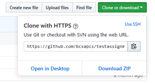
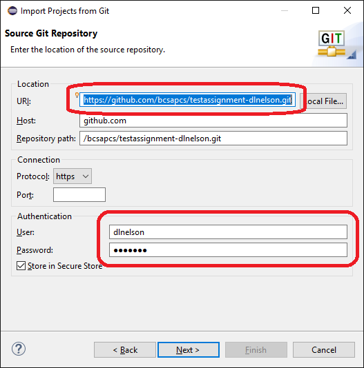
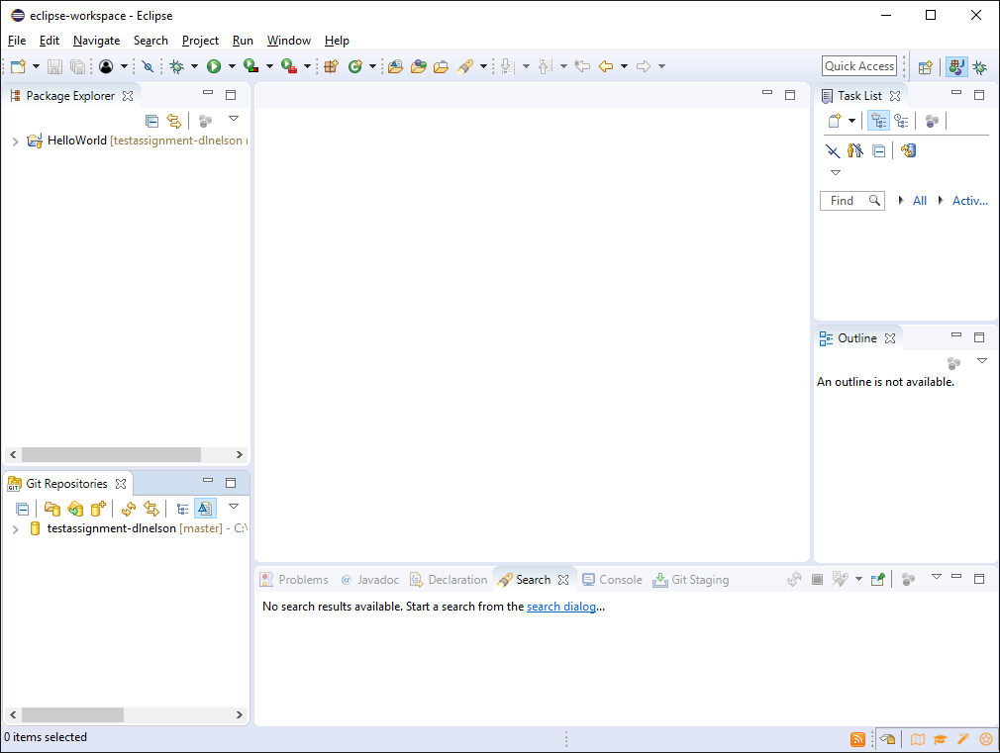
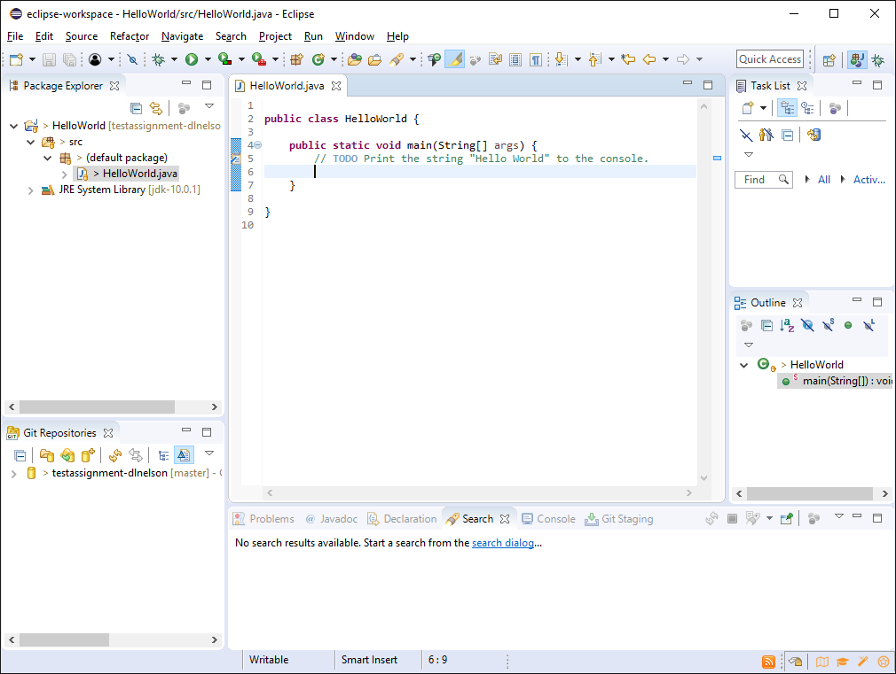
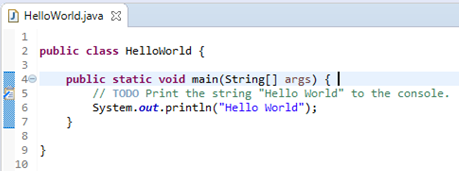
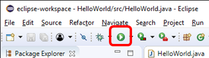
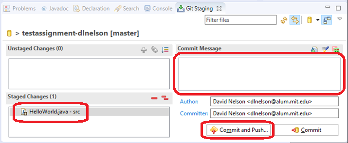
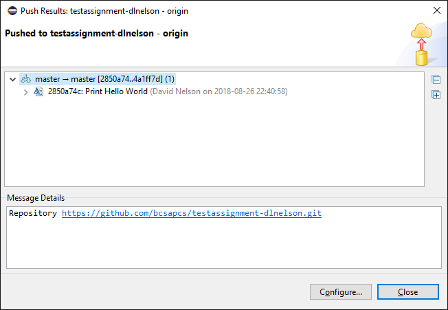

# Hello, World!

This assignment is to familiarize you with GitHub and Eclipse, and to
make sure you're set-up to write, test, and submit code.

## Cloning the Repository

First, locate and copy the "clone URL" for this repository:

Then, launch Eclipse.  If you don't see the welcome screen, choose
**Welcome** from the **Help** menu.

If you're repeating this exercise from home, and you don't have
Eclipse installed yet, you can download it from
https://www.eclipse.org/downloads/.

Choose **Checkout projects from Git**:

In the dialog that appears, select **Clone URI** and click **Next**.

Paste the URL you copied from GitHub in the URI field.  If the URL was
in your clipboard, Eclipse will automatically fill it in.

Enter your GitHub username and password in the **Authentication** area.
You can check the box to store your credentials if you like.  If you
don't, it just means you'll be prompted for them occasionally.

Click Next, Next, Next, Next, Finish.  *If you're the curious type and
don't get confused easily, try reading the dialogs you're clicking
through and guess what they're talking about.*

Eclipse should open the Java perspective:

## Writing Code

On the left, in the **Package Explorer**, click on the little ">"
symbols to expand **HelloWorld**, **src**, and **(default package)**.
Then double-click on **HelloWorld.java** to open it in the editor.

Enter the following code as shown: `System.out.println("Hello World");`

Make sure you get the spelling, capitalization, and punctuation
exactly as shown.

Save (Ctrl+S) and click the Run button on the toolbar.

If all went well, the lower portion of the screen should switch to the
**Console** tab, and the text "Hello World" should appear.

Congratulations!  Printing Hello World is a rite of passage when
starting any new programming language.

## Submitting

Now it's time to upload your work back to GitHub.  You don't need to
wait until you're done to do this.  Indeed, you should get in the
habit of pushing your work-in-progress to GitHub to facilitate
working on it from multiple locations (i.e., home and school), and as
a backup in case the worst happens to your computer.

In the **Package Explorer** on the left, **right-click** on
*HelloWorld* (the top-most node in the tree).  Go all the way down to
the **team** sub-menu and choose **Commit...*.  Alternatively, you can
use the keyboard shortcut Ctrl+# (Ctrl+Shift+3), if you find that
easier.

The **Git Staging** tab should come into focus, and your modified file
(*HelloWorld.java*) should appear in the **Stages Changes** area.  (If
it instead appears in **Unstaged Changes**, click the green ++ icon.)

In the **Commit Message** area, you should type a description of the
changes you've made.  In this case, we'll just type `Print Hello
World`.  Click **Commit and Push...**.  Enter your username and
password, if prompted.

After a little while, you should get a confirmation dialog with some
inscrutable gibberish.  Just clock **Close**.

Go back to GitHub and refresh your repository.  If you navigate to
your changed file (src/HelloWorld.java), you should see your changes.

Your work has now been submitted.

