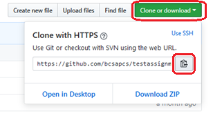
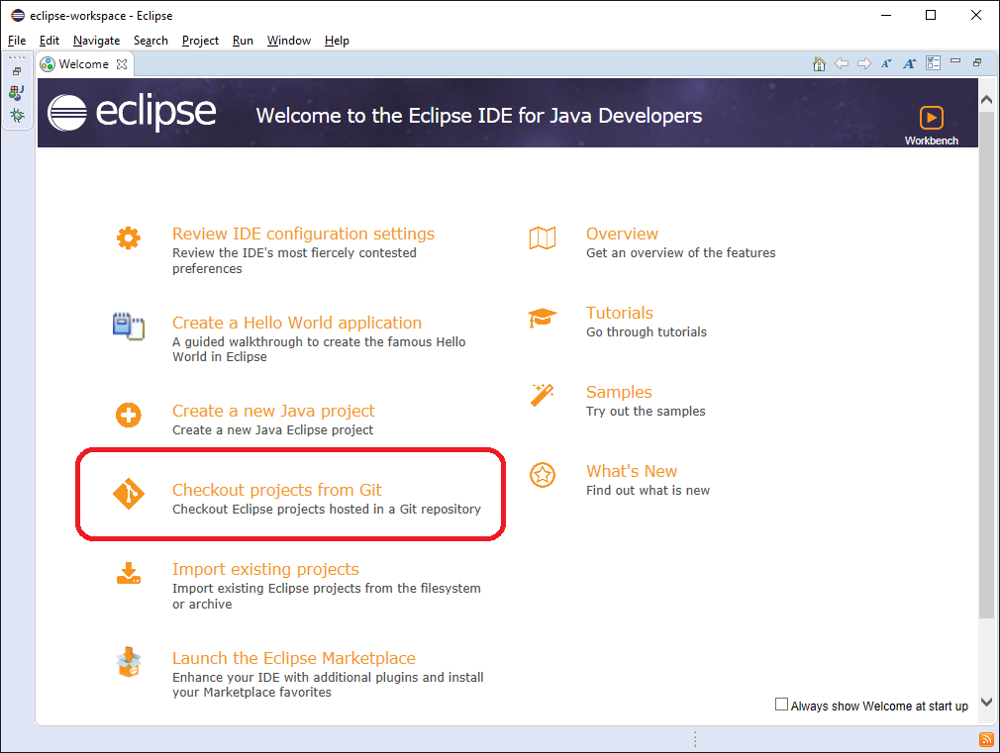

# Hello, World!

First, locate and copy the "clone URL" for this repository:

Then, launch Eclipse.  If you don't see the welcome screen, choose **Welcome** from the **Help** menu.

Choose **Checkout projects from Git**:

